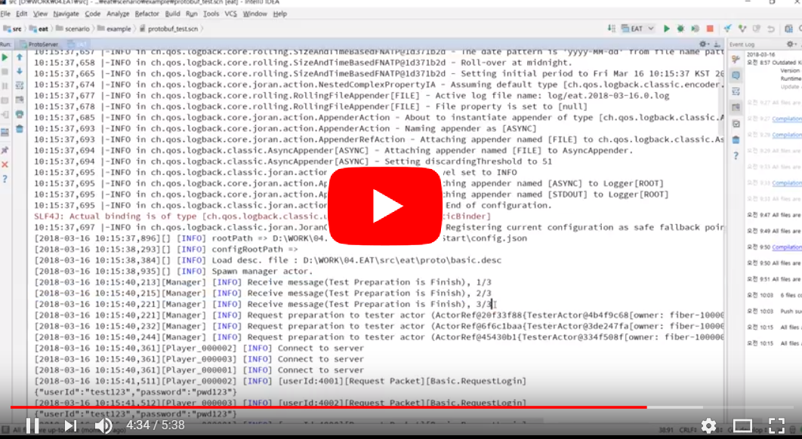
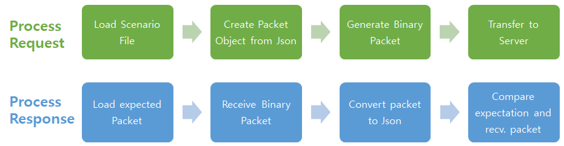
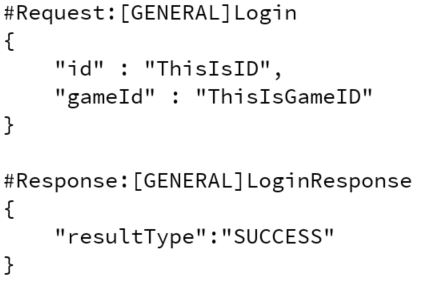
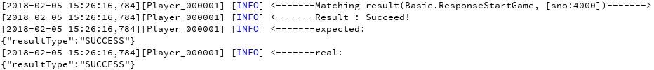
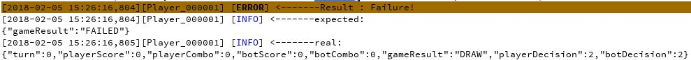
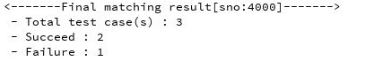
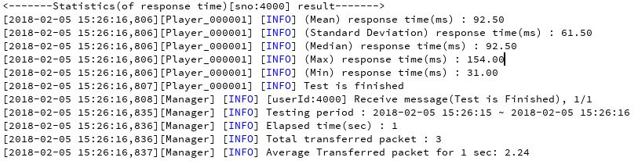
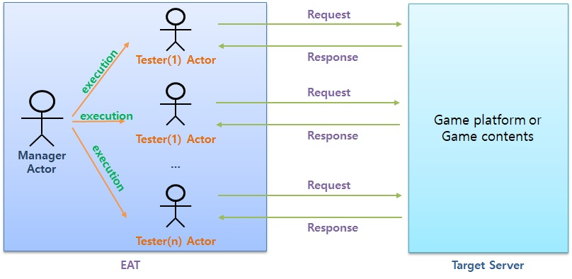

# EAT(End-point Autonomous Testing Tool)

   

## 🚩 Table of Contents

- [System Requirements](#-System-Requirements)
- Features
  - [Scenario using Json](#-scenario-using-json)
  - [Report Test Result](#-report-test-result)
- [Background](#-background)
- [Using Actor model](#-using-actor-model)
- [Communications](#-communications)
- [Contributing](#-contributing)
- [License](#-license)

------

## 🌏 System Requirements

- JDK(1.8)
- Windos, MAC, Linux

---

## 🎬 Introduction Video Clip 

[YouTube Link](https://www.youtube.com/watch?v=Sk-PUh6DHjY)

## 🎨 Features

### 📖 Scenario using Json

**Json based scenario testing tool(which can have test for functional and non-functional)**

- Transfer/Receiving packets are defined with **Json format**
- The defined Json will encoded to Binary packet, and received binary packet will decoded to Json as well.
- It provides <u>easy to understand and define</u> Test Case.
- Internally,it uses java reflection, so **developer doesn’t need consider testing implementation**, just define **Test Scenario**.

### 👫 For Who?
EAT can be used for the following developer who want have regression/load test
- Developer for Game Server
- Developer for General Server(which communicate with binary packet)

### 📃 Report Test Result

The test report will displayed with the following features

- Test result per each Scenario Unit 
- Summary for functional scenario test
- Statistics Information

#### 👍 Succeed

####  👎 Failure

####  👏 Summary

#### 🌌 Statistics

------

## 👤 Background

### End-point Testing Tool

- **Independence from client program**, server developer can have tests for their function.
- Besides Unit-testing tool, server developer need testing tool which can **test end-point**.
- Even unit function works well, we cannot guarantee that operation of service works properly. (Unit testing is not sufficient condition for full valid serviceoperation)

### Scenario base

- The scenario should **easy to read** for maintenance.
- The scenario should support **integration and regression test**.

### Expand to Load Testing.

- Based on scenario, it can support **load testing**.(ex,Peak test, Stress test and so on)

------

### 🐋 Using Actor model

–EAT is developed based on Actor model. 

–So,it can scaled out through nodes for Load Testing.

[More Detail](https://github.nhnent.com/ngt/eat/wiki/Overview/#using-actor-model)

---

## 👫 Communications

Basically, EAT supports communication method such as Strem Socket, Web Socket, RESTful API and JMX with plug-in method.
And if you want add more communication method, you can add it using plugin interface.

[More Detail](https://github.nhnent.com/ngt/eat/wiki/Overview/#architecture)

---

## 💬 Contributing

- [Code of Conduct](eat/document/CODE_OF_CONDUCT.md)

------

## 📜 License

This software is licensed under the [MIT](https://github.nhnent.com/ngt/eat/blob/develop/LICENSE) © [NHN Ent.](https://github.com/nhnent)

